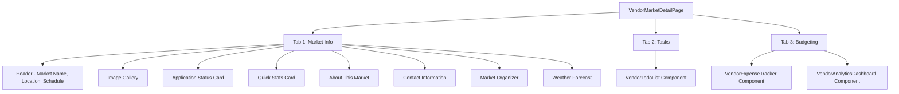

# VendorMarketDetailPage Restructuring Plan

## Objective
Restructure the VendorMarketDetailPage from 6 tabs to 3 tabs without breaking functionality or removing/adding content.

## Current Structure (6 Tabs)
| Tab | Content | Components |
|-----|---------|------------|
| Overview | Hero image, Application Status, Quick Stats, Description, Contact Info | Cards, Image Gallery |
| Preparation | Vendor todo list | Lazy-loaded `VendorTodoList` |
| Expenses | Vendor expense tracker | Lazy-loaded `VendorExpenseTracker` |
| Analytics | Analytics dashboard | Lazy-loaded `VendorAnalyticsDashboard` |
| Logistics | Placeholder for parking/transportation | Placeholder Card |
| Communication | Placeholder for direct messaging | Placeholder Card |

## Proposed Structure (3 Tabs)

### Tab 1: Market Info
All market-related information that helps vendors understand the market.

**Content moved from:**
- **Overview** (full content):
  - Hero image gallery
  - Application Status card
  - Quick Stats card
  - About This Market description
  - Contact Information
- **Logistics** (placeholder → integrated or removed)
- **Communication** (placeholder → integrated or removed)

**Sidebar content (integrated or moved):**
- Market Organizer card → Move to Market Info main content
- Weather Forecast → Move to Market Info main content
- Quick Actions → Keep in sidebar or move to Market Info

### Tab 2: Tasks
Vendor preparation tasks and tracking.

**Content moved from:**
- **Preparation** (full content):
  - `VendorTodoList` component
  - All todo tracking functionality

**Sidebar content:**
- Quick Actions → "Market Settings" could link to task-related settings

### Tab 3: Budgeting
Financial tracking and analytics.

**Content moved from:**
- **Expenses** (full content):
  - `VendorExpenseTracker` component
  - All expense tracking functionality
- **Analytics** (full content):
  - `VendorAnalyticsDashboard` component
  - Analytics and metrics

## Proposed Tab Structure



## Implementation Changes

### 1. Update Tabs Configuration
Change the tabs array from 6 items to 3 items:

```typescript
items={[
  {
    key: 'info',
    label: 'Market Info',
    icon: <MapPin className="w-4 h-4" />,
    content: <MarketInfoTabContent />
  },
  {
    key: 'tasks',
    label: 'Tasks',
    icon: <CheckCircle className="w-4 h-4" />,
    content: <TasksTabContent />
  },
  {
    key: 'budgeting',
    label: 'Budgeting',
    icon: <DollarSign className="w-4 h-4" />,
    content: <BudgetingTabContent />
  }
]}
```

### 2. Create Tab Content Components
Extract content into reusable components:

- `MarketInfoTabContent` - Contains all overview, sidebar, and placeholder content
- `TasksTabContent` - Contains VendorTodoList
- `BudgetingTabContent` - Contains VendorExpenseTracker and VendorAnalyticsDashboard

### 3. Preserve Existing Functionality
- All lazy-loaded components remain (no breaking changes)
- All API hooks remain unchanged
- All navigation and state management preserved
- Error boundaries and loading states preserved

## Content Mapping Summary

| Current Tab | New Tab | Notes |
|-------------|---------|-------|
| Overview | Market Info | Full content preserved |
| Preparation | Tasks | Full content preserved |
| Expenses | Budgeting | Full content preserved |
| Analytics | Budgeting | Full content preserved |
| Logistics | Market Info | Integrate placeholder into Market Info or remove |
| Communication | Market Info | Integrate placeholder into Market Info or remove |
| Sidebar: Organizer | Market Info | Move from sidebar to main content area |
| Sidebar: Weather | Market Info | Move from sidebar to main content area |
| Sidebar: Quick Actions | Market Info | Keep in sidebar or move to main content |

## Sidebar Consideration
The current page has a right sidebar with:
- Market Organizer card
- Weather Forecast card
- Quick Actions card

**Option A:** Keep sidebar with same content (simplest, preserves layout)
**Option B:** Move sidebar content into main tab content (cleaner, removes sidebar)

Recommendation: **Option A** - Keep sidebar as-is for quick access to actions, just reorganize main content tabs.

## Files to Modify
- `rumfor-market-tracker/src/pages/vendor/VendorMarketDetailPage.tsx` - Main changes

## Backward Compatibility
- No API changes
- No routing changes
- No component prop changes
- All existing functionality preserved
