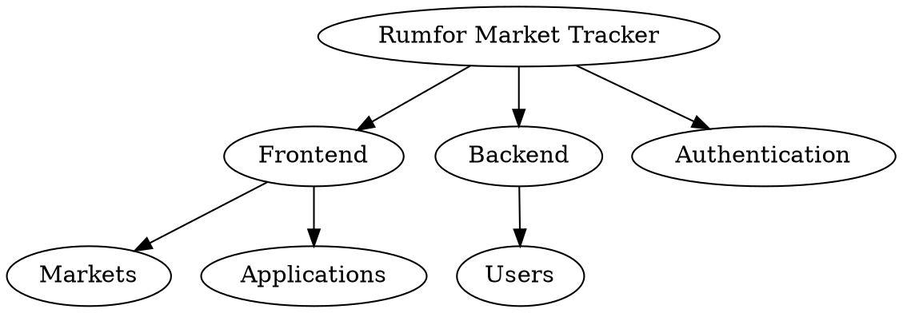

# Rumfor Infinity Rule List - Setup Guide

Step-by-step instructions to set up Rumfor Infinity Rule List in Rumfor Market Tracker.

---

## Prerequisites

### Required

- **Python 3.10+** - For the orchestrator and agents
- **Node.js 18+** - For the React frontend and build tools
- **npm 9+** - Package management
- **Git** - For checkpointing and version control
- **Roo Code** - AI coding assistant with agent mode support
- **MongoDB Atlas** - Cloud database (or local MongoDB)

### Optional

- **GraphViz** - For World Model visualization
- **Docker** - For containerized development
- **Modern browser** - For the HTML dashboards

---

## Installation

### Step 1: Verify Rumfor Market Tracker Setup

Ensure you have the market tracker project set up:

```bash
cd rumfor-market-tracker

# Check Node.js and npm
node --version  # Should be 18+
npm --version   # Should be 9+

# Install project dependencies
npm install

# Verify build works
npm run build
```

### Step 2: Copy Rumfor Orchestrator Files

Add the orchestrator to your existing project:

```bash
# Create tools directory if it doesn't exist
mkdir -p tools/rumfor_orchestrator

# Copy the core Python files
cp rumfor_orchestrator/*.py tools/rumfor_orchestrator/
cp -r rumfor_orchestrator/agents tools/rumfor_orchestrator/

# Copy the UI files
cp rumfor_world_model.html tools/
cp rumfor_control_panel.html tools/
cp compile_rumfor_status.py tools/

# Copy the agent mode definitions
cp .rumfor.roomodes ./
```

### Step 3: Set Up Python Dependencies

```bash
# Create Python virtual environment (recommended)
python -m venv venv
source venv/bin/activate  # On Windows: venv\Scripts\activate

# Install Python dependencies
pip install pyyaml graphviz
```

### Step 4: Initialize the Rumfor Directory

```bash
# Create .rumfor directory structure
mkdir -p .rumfor/{scratchpads,checkpoints,metrics,knowledge}

# Create cards directory for World Model
mkdir -p cards
```

### Step 5: Configure Roo Code

Add this to your Roo Code settings:

```json
{
  "customModesFile": ".rumfor.roomodes",
  "agentModeSwitching": true
}
```

### Step 6: Generate Initial Status

```bash
# Compile the status file (creates rumfor_status.js)
python tools/compile_rumfor_status.py

# Verify it worked
cat rumfor_status.js
```

---

## Configuration

### Customize Agent Specializations

Each agent is pre-configured for the market tracker's tech stack but can be customized:

```yaml
# .rumfor.roomodes - Frontend Agent Configuration
- slug: rumfor-frontend
  name: "Frontend Agent"
  roleDefinition: |-
    You are the Frontend specialist for Rumfor Market Tracker.

    Your responsibilities:
    - React 18 functional components with hooks
    - TypeScript strict type checking
    - Vite 4 build optimization
    - Zustand state management
    - TanStack Query for data fetching
    - Radix UI accessible components
    - UnoCSS + Tailwind CSS styling

    Key Technologies:
    - React 18.2.0 with concurrent features
    - TypeScript 5.2 with strict mode
    - Vite 4.5 with SWC compilation
    - React Hook Form + Zod validation
    - React Router 6 with protected routes
```

### Adjust Timeouts and Performance Settings

In `rumfor_orchestrator/agent_base.py`:

```python
class FrontendAgent(RumforAgent):
    # Faster for frontend tasks
    TIMEOUT_SECONDS = 180  # 3 minutes for component development
    MAX_RETRIES = 2
```

---

## Market Tracker-Specific Setup

### Frontend Agent Configuration

Optimized for React/TypeScript/Vite:

```yaml
customModes:
  - slug: rumfor-frontend
    name: "Frontend Agent"
    whenToUse: "React components, TypeScript, Vite, UI development, state management"
    customInstructions: |-
      Always:
      - Use functional components with React hooks
      - Implement proper TypeScript interfaces
      - Follow the project's file structure (src/features/, src/components/)
      - Use Zustand stores for state management
      - Implement TanStack Query for API calls
      - Ensure Radix UI components are accessible
      - Use UnoCSS for custom styling
      - Optimize bundle size and lazy loading
```

### Backend Agent Configuration

Specialized for Node.js/Express/MongoDB:

```yaml
- slug: rumfor-backend
  name: "Backend Agent"
  whenToUse: "Node.js, Express, MongoDB, API development"
  customInstructions: |-
    Always:
    - Follow REST API conventions
    - Use Express middleware properly
    - Implement MongoDB aggregation pipelines
    - Add proper error handling and logging
    - Follow the backend/src/ structure (controllers/, routes/, models/)
    - Use JWT for authentication
    - Validate inputs with middleware
    - Implement proper CORS settings
```

### Testing Agent Configuration

Integrated with Playwright and CI/CD:

```yaml
- slug: rumfor-testing
  name: "Testing Agent"
  whenToUse: "E2E tests, Playwright, code quality, CI/CD"
  customInstructions: |-
    Always:
    - Use Playwright for E2E testing (..e2e-tests/)
    - Follow existing test structure and utilities
    - Test user workflows: visitor → vendor → promoter → admin
    - Include accessibility testing
    - Verify CI/CD pipeline integration
    - Run ESLint and TypeScript checks
    - Update test utilities as needed
```

---

## World Model Setup for Market Tracker

### Create Application-Specific DOT Cards

Create `cards/market-tracker.dot`:



### Load Cards in the UI

1. Place DOT files in the `cards/` directory
2. Open `tools/rumfor_world_model.html`
3. Cards auto-load and display in the navigation tree
4. Click cards to view prompts and suggestions

---

## Verification

### Test 1: Check Roo Code Modes

Open Roo Code and verify the specialized agents:

```
Available Modes:
- rumfor-orchestrator
- rumfor-frontend
- rumfor-backend
- rumfor-api
- rumfor-styling
- rumfor-testing
- rumfor-security
- rumfor-docs
- rumfor-deploy
```

### Test 2: Open the UI

```bash
# Open the Infinity List UI
open tools/rumfor_world_model.html

# Or the standalone control panel
open tools/rumfor_control_panel.html
```

You should see:
- Agent status cards with market tracker focus
- Toggle button for Rumfor panel
- All agents showing "Ready" status

### Test 3: Test Clipboard Prompt

1. Click the **Frontend Agent** card (⚛️)
2. A toast should appear: "⚛️ Frontend prompt copied! Paste into Roo Code"
3. Paste into Roo Code
4. Roo Code should switch to `rumfor-frontend` mode

### Test 4: Run Status Compiler

```bash
python tools/compile_rumfor_status.py
```

Expected output:
```
Generated: tools/rumfor_status.js
Also generated: rumfor_status.js

--- Rumfor Orchestrator Status ---
Status: IDLE
Cycle: 0
Current Agent: None

Agents: 0 running, 0 complete
Frontend: Ready
Backend: Ready
API: Ready
Styling: Ready
Testing: Ready
Security: Ready
Documentation: Ready
Deployment: Ready
```

---

## Project-Specific Configuration

### For React/TypeScript Projects

```yaml
# Frontend Agent - React specialization
customInstructions: |-
  React/TypeScript Best Practices:
  - Use functional components with hooks
  - Implement proper TypeScript types
  - Use React.memo for expensive components
  - Follow custom hooks pattern (src/hooks/)
  - Implement error boundaries
  - Use lazy loading for route components
  - Optimize re-renders with useMemo/useCallback
```

### For Node.js/Express Projects

```yaml
# Backend Agent - Express/MongoDB specialization
customInstructions: |-
  Backend Best Practices:
  - Use Express Router for modular routes
  - Implement middleware for validation
  - Use Mongoose for MongoDB models
  - Add proper error handling and logging
  - Implement authentication middleware
  - Use environment variables for config
  - Add rate limiting and CORS
  - Follow REST API conventions
```

### For CI/CD Integration

```yaml
# Testing Agent - CI/CD specialization
customInstructions: |-
  CI/CD Integration:
  - Place e2e tests in ../e2e-tests/tests/
  - Follow existing Playwright configuration
  - Run tests against GitLab Pages staging
  - Generate coverage reports
  - Fail CI on security vulnerabilities
  - Update badges and documentation
```

---

## Troubleshooting for Market Tracker

### Issue: React/Vite Build Conflicts

**Solution:**
1. Ensure Vite dev server is restarted after agent changes
2. Check UnoCSS configuration after styling agent runs
3. Verify TypeScript paths match actual file structure
4. Clear node_modules and reinstall if build fails

### Issue: MongoDB Connection Issues

**Solution:**
1. Verify `.env` has correct MONGODB_URI
2. Check MongoDB Atlas network access
3. Ensure backend agent uses correct connection string
4. Verify database user permissions

### Issue: Authentication Token Problems

**Solution:**
1. Check JWT secret in environment variables
2. Verify token expiration settings
3. Test role-based middleware functions
4. Ensure frontend stores tokens correctly

### Issue: E2E Test Failures

**Solution:**
1. Update Playwright selectors after UI changes
2. Check test base URL matches deployment
3. Verify test user credentials are set
4. Run tests locally first: `npm run test:e2e`

### Issue: Bundle Size Increases

**Solution:**
1. Run frontend agent for bundle optimization
2. Check for duplicate dependencies
3. Implement code splitting for large components
4. Use dynamic imports for heavy libraries

---

## Advanced Setup

### Custom Agent for Specific Features

Create a specialized agent for market features:

```python
from pathlib import Path
from .agent_base import RumforAgent, AgentResult

class MarketAgent(RumforAgent):
    """Specialized agent for market management features."""

    AGENT_NAME = "Market Agent"
    AGENT_SLUG = "market"
    FOCUS_AREAS = ['market_creation', 'market_search', 'market_filtering']

    def take_turn(self) -> AgentResult:
        # Implement market-specific optimizations
        pass
```

### Remote State Storage

For collaborative development:

```python
# Custom state manager that syncs to cloud
class CloudStateManager(RumforStateManager):
    def _write_status(self, status):
        super()._write_status(status)
        # Also sync to cloud storage
        upload_to_cloud(status)
```

### Performance Monitoring Integration

Add performance tracking to agents:

```python
class PerformanceTrackingAgent(RumforAgent):
    def take_turn(self) -> AgentResult:
        start_time = time.time()
        result = super().take_turn()
        duration = time.time() - start_time

        # Log to performance metrics
        self.log_performance_metrics(duration, result)

        return result
```

---

## Next Steps After Setup

1. [Read the Usage Guide](USAGE.md) - Learn how to use the system
2. [Customize Agents](CUSTOM_AGENTS.md) - Adapt agents for your specific needs
3. [Explore the Architecture](ARCHITECTURE.md) - Understand the system internals

---

## Quick Reference

| Component | Path | Purpose |
|-----------|------|---------|
| Agent Modes | `.rumfor.roomodes` | Roo Code agent definitions |
| Orchestrator | `tools/rumfor_orchestrator/agent_base.py` | Base agent class |
| State Manager | `tools/rumfor_orchestrator/state_manager.py` | File-based state management |
| Status Compiler | `tools/compile_rumfor_status.py` | Generate JS from status |
| Main UI | `tools/rumfor_world_model.html` | World Model + Rumfor panel |
| Control Panel | `tools/rumfor_control_panel.html` | Standalone dashboard |
| Status File | `.rumfor/status.json` | Runtime state |
| Scratchpads | `.rumfor/scratchpads/*.md` | Agent memory |
| World Model | `cards/*.dot` | Application structure definitions |

---

## Integration with Existing Workflow

The Rumfor system integrates seamlessly with your existing development process:

- **GitLab CI/CD**: Agents work with existing pipelines
- **E2E Testing**: Testing agent uses your Playwright setup
- **Code Quality**: ESLint/TypeScript checks built-in
- **Documentation**: Auto-generates API docs and guides
- **Security**: Integrates with npm audit and GitLeaks
- **Deployment**: Works with GitLab Pages and Docker

The system enhances rather than replaces your development workflow.