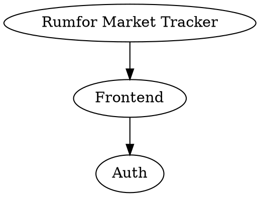

# Rumfor Infinity Rule List - Architecture

A deep dive into how the system works, component by component.

---

## Overview

Rumfor Infinity Rule List is a **file-based autonomous development system** for React/TypeScript web applications. It has three main layers:

```
┌─────────────────────────────────────────────────────────────┐
│                    LAYER 1: UI & PROMPTS                    │
│                                                             │
│  ┌──────────────┐  ┌──────────────┐  ┌──────────────┐     │
│  │ World Model  │  │ Agent Rules  │  │ Control Panel│     │
│  │ (DOT Cards)  │  │ (.rumfor.roomodes) │  │   (HTML)     │     │
│  └──────────────┘  └──────────────┘  └──────────────┘     │
└─────────────────────────────────────────────────────────────┘
                             ↓
┌─────────────────────────────────────────────────────────────┐
│                      LAYER 2: BRIDGE                         │
│                                                             │
│  ┌──────────────┐  ┌──────────────┐  ┌──────────────┐     │
│  │   Clipboard  │  │  File State  │  │   Scratch-   │     │
│  │   Prompts    │  │   (status)   │  │    pads      │     │
│  └──────────────┘  └──────────────┘  └──────────────┘     │
└─────────────────────────────────────────────────────────────┘
                             ↓
┌─────────────────────────────────────────────────────────────┐
│                    LAYER 3: EXECUTION                        │
│                                                             │
│  ┌──────────────┐  ┌──────────────┐  ┌──────────────┐     │
│  │  Roo Code    │  │    8 x       │  │    Git       │     │
│  │ Agent Modes  │  │  Specialist  │  │  Checkpoints │     │
│  │              │  │    Agents    │  │              │     │
│  └──────────────┘  └──────────────┘  └──────────────┘     │
└─────────────────────────────────────────────────────────────┘
```

---

## Layer 1: UI & Prompts

### World Model (DOT Cards)

The World Model is a hierarchical card system stored as DOT files for the Rumfor Market Tracker:



Each card has:
- **ID**: Unique identifier (e.g., "Frontend.Auth.OAuth")
- **Type**: `root`, `category`, or `card`
- **Prompt**: The AI context/prompt for that card
- **Metadata**: Agent suggestions, priority, status, tech stack

### Agent Rules (.rumfor.roomodes)

Each specialist agent is defined in `.rumfor.roomodes`:

```yaml
customModes:
  - slug: rumfor-frontend
    name: "Frontend Agent"
    roleDefinition: |-
      You are the Frontend specialist for Rumfor Market Tracker.

      Your responsibilities:
      - React component development with TypeScript
      - Vite build optimization and configuration
      - Zustand state management implementation
      - TanStack Query for data fetching
      - React Hook Form + Zod validation
      - UnoCSS + Tailwind CSS styling

      Technology Stack Priority:
      - React 18 with hooks pattern
      - TypeScript for type safety
      - Vite for fast development builds
    whenToUse: "React, TypeScript, Vite, UI development"
    description: "Frontend React/TypeScript specialist"
    groups: ["read", "edit", "command"]
    customInstructions: |-
      Always:
      - Use functional components with hooks
      - Implement proper TypeScript types
      - Follow React best practices
      - Ensure accessibility with Radix UI
      - Optimize bundle size and performance
```

The `.rumfor.roomodes` file defines:
- **Agent personality** (roleDefinition)
- **When to use** (whenToUse)
- **Allowed operations** (groups: read, edit, command, browser)
- **Custom instructions** (special behaviors)

### Control Panel (HTML)

The Rumfor Infinity List UI (`rumfor_world_model.html`) has three sections:

1. **Left Sidebar**: World Model navigation tree for market tracker features
2. **Center**: GraphViz visualization of the application hierarchy
3. **Right Sidebar**: Rumfor Orchestrator panel (toggleable)

```javascript
// The UI reads status from rumfor_status.js
const rumforStatus = {
  "orchestrator": { "status": "idle", "current_cycle": 0 },
  "agents": {
    "frontend": { "status": "complete", "progress": 100 },
    "backend": { "status": "idle", "progress": 0 }
  }
};
```

---

## Layer 2: Bridge

### Clipboard Prompts

When you click an agent button, JavaScript generates a prompt:

```javascript
function generateAgentPrompt(agentId) {
    const agent = rumforAgents.find(a => a.id === agentId);
    const modeSlug = getAgentModeSlug(agentId);  // e.g., "rumfor-frontend"

    let prompt = `I want to run the ${agent.name} Agent for Rumfor Market Tracker.\n\n`;

    // Include World Model context if a card is selected
    if (selectedCard) {
        prompt += `Context from World Model card "${cardId}":\n${cardPrompt}\n\n`;
    }

    prompt += `Switch to the ${modeSlug} mode and complete the ${agent.name} Agent's responsibilities.`;

    return prompt;
}
```

This prompt is copied to clipboard, then you paste into Roo Code.

### File State System

The state file at `.rumfor/status.json` is the single source of truth:

```json
{
  "orchestrator": {
    "status": "idle|running|stopped|error",
    "current_cycle": 5,
    "current_agent": "frontend",
    "start_time": "2026-01-08T10:30:00",
    "last_update": "2026-01-08T10:45:23"
  },
  "agents": {
    "frontend": {
      "status": "complete",
      "last_run": "2026-01-08T10:32:15",
      "last_result": "Component optimization completed",
      "progress": 100,
      "message": "Completed: Optimized bundle size by 30%"
    },
    "backend": {
      "status": "running",
      "progress": 65,
      "message": "Implementing MongoDB integration..."
    }
  }
}
```

**Why JSON?**
- Human-readable
- Easy to parse in any language
- Simple to merge/resolve conflicts
- Works great with git

### Scratchpad System

Each agent has a persistent scratchpad at `.rumfor/scratchpads/{agent}_scratchpad.md`:

```markdown
# Frontend Agent Scratchpad

## Context
- Project: Rumfor Market Tracker
- Tech Stack: React 18 + TypeScript + Vite
- Styling: Tailwind CSS + UnoCSS + Radix UI
- State: Zustand + TanStack Query

## Completed
- [2026-01-08 10:32] Implemented responsive market grid component
- [2026-01-08 10:35] Added TypeScript types for all form schemas
- [2026-01-08 10:37] Optimized Vite build configuration

## In Progress
- Improving vendor application form UX

## Blocked On
- Waiting for Backend Agent to provide new API endpoint

## Next Actions
1. Add dark mode toggle functionality
2. Implement lazy loading for market photos
3. Optimize mobile performance

## Notes
- UnoCSS requires restarting dev server after config changes
- Radix UI components provide excellent accessibility
- Bundle analyzer shows largest chunks are Recharts + React Calendar
```

**Why Markdown?**
- Easy for AI to read and write
- Human-readable
- Git-friendly (diffs are clear)
- Supports structure (headers, lists, code blocks)

---

## Layer 3: Execution

### Agent Lifecycle

```
┌─────────────────────────────────────────────────────────────┐
│                     AGENT LIFECYCLE                          │
└─────────────────────────────────────────────────────────────┘

    1. READ SCRATCHPAD
       └──> Load previous state from .rumfor/scratchpads/{agent}_scratchpad.md

    2. MARK START
       └──> status.json: {agent}.status = "running"
       └──> UI shows agent as "running" with pulse animation

    3. EXECUTE RESPONSIBILITIES
       └──> Perform agent-specific work for market tracker
       └──> Update scratchpad with progress

    4. UPDATE PROGRESS
       └──> status.json: {agent}.progress = 0-100
       └──> UI progress bar updates

    5. MARK COMPLETE
       └──> status.json: {agent}.status = "complete"
       └──> UI shows agent as "complete"

    6. WRITE SCRATCHPAD
       └──> Save final state to scratchpad

    7. CREATE CHECKPOINT (if progress_made)
       └──> git commit with descriptive message
       └──> Tag with agent name and cycle

    8. NEXT AGENT
       └──> Orchestrator moves to next agent in sequence
```

### Agent Base Class

All agents inherit from `RumforAgent`:

```python
class RumforAgent(ABC):
    """Base class for Rumfor Wiggum-style agents."""

    AGENT_NAME: str = "Frontend Agent"
    AGENT_SLUG: str = "frontend"
    TIMEOUT_SECONDS: int = 300
    MAX_RETRIES: int = 3

    def __init__(self, scratch_dir: Optional[Path] = None):
        self.scratchpad = Scratchpad(scratch_dir / f"{self.slug}_scratchpad.md")
        self._state_manager = get_state_manager()

    @abstractmethod
    def take_turn(self) -> AgentResult:
        """Execute one turn of this agent."""
        raise NotImplementedError

    # Scratchpad methods
    def read_scratchpad(self) -> str: ...
    def write_scratchpad(self, content: str) -> None: ...
    def update_scratchpad_section(self, section: str, content: str) -> None: ...

    # Status methods
    def mark_start(self) -> None: ...
    def mark_complete(self, result: str) -> None: ...
    def mark_error(self, error: str) -> None: ...
    def update_progress(self, progress: int, message: str) -> None: ...
```

### Agent Result

Each agent returns an `AgentResult`:

```python
@dataclass
class AgentResult:
    success: bool = True              # Did the agent succeed?
    progress_made: bool = False       # Should we create a checkpoint?
    message: str = ""                 # Human-readable summary
    next_actions: List[str] = []      # Suggestions for next turn
    files_modified: List[str] = []    # What files were changed
    error: Optional[str] = None       # Error if failed
    metadata: Dict[str, Any] = {}     # Additional data
```

---

## The Orchestrator Loop

```
┌─────────────────────────────────────────────────────────────┐
│                  ORCHESTRATOR MAIN LOOP                     │
└─────────────────────────────────────────────────────────────┘

while True:
    for agent in [frontend, backend, api, styling, testing, security, documentation, deployment]:
        # 1. Agent takes turn
        result = agent.take_turn()

        # 2. Update status
        if result.success:
            agent.mark_complete(result.message)
        else:
            agent.mark_error(result.error)

        # 3. Create checkpoint if progress made
        if result.progress_made:
            create_git_checkpoint(agent, result)

        # 4. Brief pause for UI updates
        time.sleep(1)

    # All agents done - increment cycle
    increment_cycle()

    # Self-improvement analysis
    run_self_improvement()

    # Update World Model
    update_world_model_cards()

    # Start next cycle immediately
    # "I'm going to sleep, then when I wake up, I'm going to eat!"
```

---

## File Structure

```
rumfor-market-tracker/
├── .rumfor/
│   ├── status.json              # Runtime state (written by agents)
│   ├── scratchpads/             # Agent persistent memory
│   │   ├── frontend_scratchpad.md
│   │   ├── backend_scratchpad.md
│   │   ├── api_scratchpad.md
│   │   ├── styling_scratchpad.md
│   │   ├── testing_scratchpad.md
│   │   ├── security_scratchpad.md
│   │   ├── documentation_scratchpad.md
│   │   └── deployment_scratchpad.md
│   ├── checkpoints/             # Git checkpoint metadata
│   │   └── checkpoints.json
│   ├── metrics/                 # Performance metrics
│   │   └── metrics.json
│   └── knowledge/               # Accumulated knowledge
│       └── knowledge_base.json
│
├── tools/
│   ├── rumfor_orchestrator/
│   │   ├── orchestrator.py      # Main orchestrator loop
│   │   ├── agent_base.py        # Base class for all agents
│   │   ├── state_manager.py     # File-based state management
│   │   ├── scratchpad.py        # Scratchpad I/O
│   │   ├── mode_generator.py    # Generates .rumfor.roomodes
│   │   └── agents/              # Specialist agent implementations
│   │       ├── frontend_agent.py
│   │       ├── backend_agent.py
│   │       ├── api_agent.py
│   │       ├── styling_agent.py
│   │       ├── testing_agent.py
│   │       ├── security_agent.py
│   │       ├── documentation_agent.py
│   │       └── deployment_agent.py
│   │
│   ├── rumfor_world_model.html    # Main UI (Infinity List + Rumfor panel)
│   ├── rumfor_control_panel.html # Standalone control dashboard
│   ├── compile_rumfor_status.py  # Generates JS from status.json
│   └── rumfor_status.js          # Compiled status (auto-generated)
│
├── cards/                       # World Model DOT files
│   ├── frontend.dot
│   ├── backend.dot
│   ├── authentication.dot
│   └── ...
│
└── .rumfor.roomodes                    # Roo Code agent mode definitions
```

---

## Key Design Decisions

### Why File-Based State?
1. **Transparent**: Inspect state at any time
2. **Debuggable**: Git diff shows state changes
3. **Recoverable**: Restore from any checkpoint
4. **Language-agnostic**: Works with any tooling

### Why Scratchpads?
1. **Persistent memory**: Agents remember across cycles
2. **Human-readable**: Review what agents were thinking
3. **Git-tracked**: See how agent knowledge evolved
4. **Context accumulation**: Each cycle builds on the last

### Why Deterministic Loops?
1. **Predictable**: Know what happens next
2. **Fair**: Every agent gets a turn every cycle
3. **Simple**: No complex scheduling
4. **Observable**: Easy to track progress

### Why Git Checkpoints?
1. **Rollback**: Undo any agent's work
2. **History**: See code evolution
3. **Bisect**: Find when bugs introduced
4. **Collaboration**: Team sees agent changes

---

## Extension Points

### Adding a New Agent

1. Define in `.rumfor.roomodes`:
```yaml
- slug: rumfor-performance
  name: "Performance Agent"
  roleDefinition: "..."
```

2. Create agent class:
```python
class PerformanceAgent(RumforAgent):
    AGENT_NAME = "Performance Agent"
    AGENT_SLUG = "performance"

    def take_turn(self) -> AgentResult:
        # Implement performance optimizations
        pass
```

3. Add to orchestrator loop:
```python
agents = [..., PerformanceAgent()]
```

### Custom Status UI

Read `rumfor_status.js` and build your dashboard:

```javascript
const status = rumforStatus;
// Build custom UI based on status
```

### Alternative Frontends

The file-based API works with any frontend:
- Web dashboard (React/Vue)
- CLI tool (Node/Python)
- VS Code extension
- Desktop app (Electron)

---

## Performance Considerations

### Status File Updates
- Agents write status on significant actions
- UI polls every 2 seconds when panel open
- Use `asyncio` or threading to avoid blocking

### Scratchpad Size
- Scratchpads grow over time
- Implement archival for old entries
- Consider summary sections for long-running agents

### Git Checkpoints
- Only checkpoint if `progress_made == true`
- Use shallow clones for large histories
- Tag checkpoints with agent and cycle

---

## Security Considerations

### File Permissions
- `.rumfor/` should be project-local only
- Don't commit sensitive data in scratchpads
- Use `.gitignore` for temporary state

### Prompt Injection
- Validate prompts from World Model cards
- Sanitize user input before inclusion
- Be careful with file operations

---

## Troubleshooting

### Status File Corruption
If `status.json` is corrupted:
```bash
rm .rumfor/status.json
python tools/compile_rumfor_status.py  # Will regenerate with defaults
```

### Agent Not Updating Status
Check:
1. Agent calls `mark_start()` / `mark_complete()`
2. `.rumfor/` directory is writable
3. No concurrent writes (use locks)

### UI Not Refreshing
Check:
1. `rumfor_status.js` is being generated
2. Script tag points to correct path
3. Browser cache cleared (Ctrl+Shift+R)

---

## References

- [Roo Code Documentation](https://github.com/orgs/xyz) - Agent mode system
- [GraphViz](https://graphviz.org/) - DOT file format
- [Rumfor Market Tracker](https://gitlab.com/your-username/rumfor-market-tracker) - Original project