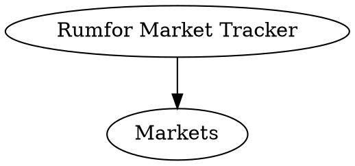

# World Model Cards

Add GraphViz DOT files here to define the Rumfor Market Tracker world model.

Example:

```dot
digraph WorldModel {
  "ROOT" [label="Rumfor Market Tracker", type="root"];
  "ROOT" -> "Markets";
  "Markets" [label="Markets", type="category", prompt="Review market discovery UX flows."];
}
```
