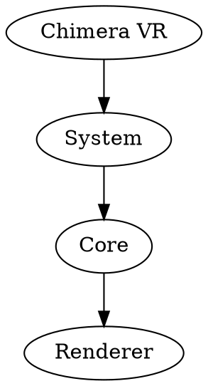

# Ralph's Infinity Rule List - Architecture

A deep dive into how the system works, component by component.

---

## Overview

Ralph's Infinity Rule List is a **file-based autonomous development system**. It has three main layers:

```
┌─────────────────────────────────────────────────────────────┐
│                    LAYER 1: UI & PROMPTS                    │
│                                                             │
│  ┌──────────────┐  ┌──────────────┐  ┌──────────────┐     │
│  │ World Model  │  │ Agent Rules  │  │ Control Panel│     │
│  │ (DOT Cards)  │  │ (.roomodes)  │  │   (HTML)     │     │
│  └──────────────┘  └──────────────┘  └──────────────┘     │
└─────────────────────────────────────────────────────────────┘
                            ↓
┌─────────────────────────────────────────────────────────────┐
│                      LAYER 2: BRIDGE                         │
│                                                             │
│  ┌──────────────┐  ┌──────────────┐  ┌──────────────┐     │
│  │   Clipboard  │  │  File State  │  │   Scratch-   │     │
│  │   Prompts    │  │   (status)   │  │    pads      │     │
│  └──────────────┘  └──────────────┘  └──────────────┘     │
└─────────────────────────────────────────────────────────────┘
                            ↓
┌─────────────────────────────────────────────────────────────┐
│                    LAYER 3: EXECUTION                        │
│                                                             │
│  ┌──────────────┐  ┌──────────────┐  ┌──────────────┐     │
│  │  Roo Code    │  │    8 x       │  │    Git       │     │
│  │ Agent Modes  │  │  Specialist  │  │  Checkpoints │     │
│  │              │  │    Agents    │  │              │     │
│  └──────────────┘  └──────────────┘  └──────────────┘     │
└─────────────────────────────────────────────────────────────┘
```

---

## Layer 1: UI & Prompts

### World Model (DOT Cards)

The World Model is a hierarchical card system stored as DOT files:



Each card has:
- **ID**: Unique identifier (e.g., "System.Core.Renderer")
- **Type**: `root`, `category`, or `card`
- **Prompt**: The AI context/prompt for that card
- **Metadata**: Agent suggestions, priority, status

### Agent Rules (.roomodes)

Each specialist agent is defined in `.roomodes`:

```yaml
customModes:
  - slug: agent1-build
    name: "Build Agent"
    roleDefinition: |-
      You are the Build System specialist for Chimera VR.

      Your responsibilities:
      - CMake configuration and generation
      - Compilation error diagnosis and fixing
      - bgfx tool integration

      Key CMake options:
      - CHIMERA_BUILD_RENDERING=ON
      - CHIMERA_BUILD_VR=ON
    whenToUse: "CMake configuration, compilation errors, build fixes"
    description: "CMake, compilation, and build system specialist"
    groups: ["read", "edit", "command"]
    customInstructions: |-
      Always:
      - Check build/ directory
      - Use Release configuration
      - Verify build output
```

The `.roomodes` file defines:
- **Agent personality** (roleDefinition)
- **When to use** (whenToUse)
- **Allowed operations** (groups: read, edit, command, browser)
- **Custom instructions** (special behaviors)

### Control Panel (HTML)

The Infinity List UI (`zoom_world_model.html`) has three sections:

1. **Left Sidebar**: World Model navigation tree
2. **Center**: GraphViz visualization of the card hierarchy
3. **Right Sidebar**: Ralph Orchestrator panel (toggleable)

```javascript
// The UI reads status from ralph_status.js
const ralphStatus = {
  "orchestrator": { "status": "idle", "current_cycle": 0 },
  "agents": {
    "build": { "status": "complete", "progress": 100 },
    "assets": { "status": "idle", "progress": 0 }
  }
};
```

---

## Layer 2: Bridge

### Clipboard Prompts

When you click an agent button, JavaScript generates a prompt:

```javascript
function generateAgentPrompt(agentId) {
    const agent = ralphAgents.find(a => a.id === agentId);
    const modeSlug = getAgentModeSlug(agentId);  // e.g., "agent1-build"

    let prompt = `I want to run the ${agent.name} Agent for Chimera VR.\n\n`;

    // Include World Model context if a card is selected
    if (selectedCard) {
        prompt += `Context from World Model card "${cardId}":\n${cardPrompt}\n\n`;
    }

    prompt += `Switch to the ${modeSlug} mode and complete the ${agent.name} Agent's responsibilities.`;

    return prompt;
}
```

This prompt is copied to clipboard, then you paste into Roo Code.

### File State System

The state file at `.ralph/status.json` is the single source of truth:

```json
{
  "orchestrator": {
    "status": "idle|running|stopped|error",
    "current_cycle": 5,
    "current_agent": "build",
    "start_time": "2026-01-08T10:30:00",
    "last_update": "2026-01-08T10:45:23"
  },
  "agents": {
    "build": {
      "status": "complete",
      "last_run": "2026-01-08T10:32:15",
      "last_result": "Build completed successfully",
      "progress": 100,
      "message": "Completed: Fixed CMake config"
    },
    "assets": {
      "status": "running",
      "progress": 45,
      "message": "Converting glTF files..."
    }
  }
}
```

**Why JSON?**
- Human-readable
- Easy to parse in any language
- Simple to merge/resolve conflicts
- Works great with git

### Scratchpad System

Each agent has a persistent scratchpad at `.ralph/scratchpads/{agent}_scratchpad.md`:

```markdown
# Build Agent Scratchpad

## Context
- Project: Chimera VR
- Build System: CMake + bgfx
- Build Dir: chimera-vr/build/

## Completed
- [2026-01-08 10:32] Fixed CMake configuration for VR rendering
- [2026-01-08 10:35] Added missing OpenXR dependencies

## In Progress
- Optimizing shader compilation (currently taking 45s)

## Blocked On
- Waiting for Assets Agent to provide new textures

## Next Actions
1. Investigate texture compression issues
2. Set up precompiled headers
3. Add build cache for external dependencies

## Notes
- The bgfx shaderc tool needs to be in PATH
- Release builds are significantly faster than Debug
```

**Why Markdown?**
- Easy for AI to read and write
- Human-readable
- Git-friendly (diffs are clear)
- Supports structure (headers, lists, code blocks)

---

## Layer 3: Execution

### Agent Lifecycle

```
┌─────────────────────────────────────────────────────────────┐
│                     AGENT LIFECYCLE                          │
└─────────────────────────────────────────────────────────────┘

    1. READ SCRATCHPAD
       └──> Load previous state from .ralph/scratchpads/{agent}_scratchpad.md

    2. MARK START
       └──> status.json: {agent}.status = "running"
       └──> UI shows agent as "running" with pulse animation

    3. EXECUTE RESPONSIBILITIES
       └──> Perform agent-specific work
       └──> Update scratchpad with progress

    4. UPDATE PROGRESS
       └──> status.json: {agent}.progress = 0-100
       └──> UI progress bar updates

    5. MARK COMPLETE
       └──> status.json: {agent}.status = "complete"
       └──> UI shows agent as "complete"

    6. WRITE SCRATCHPAD
       └──> Save final state to scratchpad

    7. CREATE CHECKPOINT (if progress_made)
       └──> git commit with descriptive message
       └──> Tag with agent name and cycle

    8. NEXT AGENT
       └──> Orchestrator moves to next agent in sequence
```

### Agent Base Class

All agents inherit from `RalphAgent`:

```python
class RalphAgent(ABC):
    """Base class for Ralph Wiggum-style agents."""

    AGENT_NAME: str = "Build Agent"
    AGENT_SLUG: str = "build"
    TIMEOUT_SECONDS: int = 300
    MAX_RETRIES: int = 3

    def __init__(self, scratch_dir: Optional[Path] = None):
        self.scratchpad = Scratchpad(scratch_dir / f"{self.slug}_scratchpad.md")
        self._state_manager = get_state_manager()

    @abstractmethod
    def take_turn(self) -> AgentResult:
        """Execute one turn of this agent."""
        raise NotImplementedError

    # Scratchpad methods
    def read_scratchpad(self) -> str: ...
    def write_scratchpad(self, content: str) -> None: ...
    def update_scratchpad_section(self, section: str, content: str) -> None: ...

    # Status methods
    def mark_start(self) -> None: ...
    def mark_complete(self, result: str) -> None: ...
    def mark_error(self, error: str) -> None: ...
    def update_progress(self, progress: int, message: str) -> None: ...
```

### Agent Result

Each agent returns an `AgentResult`:

```python
@dataclass
class AgentResult:
    success: bool = True              # Did the agent succeed?
    progress_made: bool = False       # Should we create a checkpoint?
    message: str = ""                 # Human-readable summary
    next_actions: List[str] = []      # Suggestions for next turn
    files_modified: List[str] = []    # What files were changed
    error: Optional[str] = None       # Error if failed
    metadata: Dict[str, Any] = {}     # Additional data
```

---

## The Orchestrator Loop

```
┌─────────────────────────────────────────────────────────────┐
│                  ORCHESTRATOR MAIN LOOP                     │
└─────────────────────────────────────────────────────────────┘

while True:
    for agent in [build, assets, world_data, vr, physics, testing, screenshot, documentation]:
        # 1. Agent takes turn
        result = agent.take_turn()

        # 2. Update status
        if result.success:
            agent.mark_complete(result.message)
        else:
            agent.mark_error(result.error)

        # 3. Create checkpoint if progress made
        if result.progress_made:
            create_git_checkpoint(agent, result)

        # 4. Brief pause for UI updates
        time.sleep(1)

    # All agents done - increment cycle
    increment_cycle()

    # Self-improvement analysis
    run_self_improvement()

    # Update Infinity List
    update_world_model_cards()

    # Start next cycle immediately
    # "I'm going to sleep, then when I wake up, I'm going to eat!"
```

---

## State Manager

Thread-safe file-based state management:

```python
class RalphStateManager:
    """Manages Ralph Orchestrator state through file-based storage."""

    def __init__(self, ralph_dir: Optional[Path] = None):
        self.status_file = ralph_dir / "status.json"
        self.lock = threading.Lock()

    def update_agent_status(self, agent_name: str, **kwargs):
        """Thread-safe status update."""
        with self.lock:
            state = self._read_status()
            agent_state = state["agents"][agent_name]
            for key, value in kwargs.items():
                agent_state[key] = value
            self._write_status(state)

    def mark_agent_start(self, agent_name: str):
        self.update_agent_status(
            agent_name,
            status="running",
            progress=0,
            message=f"Running {agent_name} agent..."
        )
```

**Why Thread-Safe?**
- Multiple agents might write concurrently
- UI might read while agents write
- Prevents corrupted JSON files

---

## Data Flow

### Reading Status

```
┌─────────────────────────────────────────────────────────────┐
│                      READ DATA FLOW                         │
└─────────────────────────────────────────────────────────────┘

Python Agent              State Manager              File/JS
     │                          │                        │
     │  get_status()            │                        │
     ├─────────────────────────>│                        │
     │                          │  read JSON             │
     │                          ├───────────────────────>│
     │                          │                        │
     │                          │  return dict           │
     │                          │<───────────────────────┤
     │  return status           │                        │
     │<─────────────────────────┤                        │
     │                          │                        │
                                                             ┌───┐
                                                             │UI │
                                                             └─▲─┘
                                                               │
                                        load ralph_status.js  │
                                        <─────────────────────┘
```

### Writing Status

```
┌─────────────────────────────────────────────────────────────┐
│                      WRITE DATA FLOW                        │
└─────────────────────────────────────────────────────────────┘

Python Agent              State Manager              File
     │                          │                        │
     │  mark_start()            │                        │
     ├─────────────────────────>│                        │
     │                          │  acquire lock          │
     │                          ├────────────────────┐   │
     │                          │                    │   │
     │                          │  read JSON         │   │
     │                          ├───────────────────>│   │
     │                          │                    │   │
     │                          │  modify dict       │   │
     │                          │<───────────────────┤   │
     │                          │                    │   │
     │                          │  write JSON        │   │
     │                          ├───────────────────>│   │
     │                          │                    │   │
     │                          │  release lock      │   │
     │                          │<──────────────────┘   │
     │                          │                        │
     │  return                  │                        │
     │<─────────────────────────┤                        │
                                                             │
                                                    status.json updated
                                                    (UI refreshes on next poll)
```

---

## File Structure

```
project/
├── .ralph/
│   ├── status.json              # Runtime state (written by agents)
│   ├── scratchpads/             # Agent persistent memory
│   │   ├── build_scratchpad.md
│   │   ├── assets_scratchpad.md
│   │   ├── world_data_scratchpad.md
│   │   ├── vr_scratchpad.md
│   │   ├── physics_scratchpad.md
│   │   ├── testing_scratchpad.md
│   │   ├── screenshot_scratchpad.md
│   │   └── documentation_scratchpad.md
│   ├── checkpoints/             # Git checkpoint metadata
│   │   └── checkpoints.json
│   ├── metrics/                 # Performance metrics
│   │   └── metrics.json
│   └── knowledge/               # Accumulated knowledge
│       └── knowledge_base.json
│
├── tools/
│   ├── ralph_orchestrator/
│   │   ├── orchestrator.py      # Main orchestrator loop
│   │   ├── agent_base.py        # Base class for all agents
│   │   ├── state_manager.py     # File-based state management
│   │   ├── scratchpad.py        # Scratchpad I/O
│   │   ├── mode_generator.py    # Generates .roomodes
│   │   └── agents/              # Specialist agent implementations
│   │       ├── build_agent.py
│   │       ├── assets_agent.py
│   │       ├── world_data_agent.py
│   │       ├── vr_agent.py
│   │       ├── physics_agent.py
│   │       ├── testing_agent.py
│   │       ├── screenshot_agent.py
│   │       └── documentation_agent.py
│   │
│   ├── zoom_world_model.html    # Main UI (Infinity List + Ralph panel)
│   ├── ralph_control_panel.html # Standalone control dashboard
│   ├── compile_ralph_status.py  # Generates JS from status.json
│   └── ralph_status.js          # Compiled status (auto-generated)
│
├── cards/                       # World Model DOT files
│   ├── system.dot
│   ├── vr.dot
│   ├── physics.dot
│   └── ...
│
└── .roomodes                    # Roo Code agent mode definitions
```

---

## Key Design Decisions

### Why File-Based State?

1. **Transparent**: Can inspect state at any time
2. **Debuggable**: Git diff shows state changes
3. **Recoverable**: Can restore from any checkpoint
4. **Language-agnostic**: Works with any tooling
5. **No dependencies**: No database or server needed

### Why Scratchpads?

1. **Persistent memory**: Agents remember across cycles
2. **Human-readable**: Can review what agents were thinking
3. **Git-tracked**: See how agent knowledge evolved
4. **Context accumulation**: Each cycle builds on the last

### Why Deterministic Loops?

1. **Predictable**: Always know what happens next
2. **Fair**: Every agent gets a turn every cycle
3. **Simple**: No complex scheduling or prioritization
4. **Observable**: Easy to track progress

### Why Git Checkpoints?

1. **Rollback**: Can undo any agent's work
2. **History**: See how code evolved
3. **Bisect**: Find when bugs were introduced
4. **Collaboration**: Team can see agent changes

---

## Extension Points

### Adding a New Agent

1. Define in `.roomodes`:
```yaml
- slug: agent9-security
  name: "Security Agent"
  roleDefinition: "..."
```

2. Create agent class:
```python
class SecurityAgent(RalphAgent):
    AGENT_NAME = "Security Agent"
    AGENT_SLUG = "security"

    def take_turn(self) -> AgentResult:
        # Implement security checks
        pass
```

3. Add to orchestrator loop:
```python
agents = [..., SecurityAgent()]
```

### Custom Status UI

Read `ralph_status.js` and build your own dashboard:

```javascript
const status = ralphStatus;
// Build custom UI based on status
```

### Alternative Frontends

The file-based API works with any frontend:
- Web dashboard (HTML/JS)
- CLI tool (Python/bash)
- VS Code extension
- Desktop app (Electron)

---

## Performance Considerations

### Status File Updates

- Agents write status on every significant action
- UI polls every 2 seconds when panel open
- Use `asyncio` or threading to avoid blocking

### Scratchpad Size

- Scratchpads grow over time
- Implement archival for old entries
- Consider summary sections for long-running agents

### Git Checkpoints

- Only checkpoint if `progress_made == true`
- Use shallow clones for large histories
- Tag checkpoints with agent and cycle for easy navigation

---

## Security Considerations

### File Permissions

- `.ralph/` should be project-local only
- Don't commit sensitive data in scratchpads
- Use `.gitignore` for temporary state files

### Prompt Injection

- Validate prompts from World Model cards
- Sanitize user input before including in agent prompts
- Be careful with file operations in agent code

---

## Troubleshooting

### Status File Corruption

If `status.json` is corrupted:
```bash
rm .ralph/status.json
python tools/compile_ralph_status.py  # Will regenerate with defaults
```

### Agent Not Updating Status

Check:
1. Agent is calling `mark_start()` / `mark_complete()`
2. `.ralph/` directory is writable
3. No concurrent writes (use locks)

### UI Not Refreshing

Check:
1. `ralph_status.js` is being generated
2. Script tag in HTML points to correct path
3. Browser cache is cleared (Ctrl+Shift+R)

---

## References

- [Roo Code Documentation](https://github.com/orgs/xyz) - Agent mode system
- [GraphViz](https://graphviz.org/) - DOT file format
- [Chimera VR](https://github.com/your-org/chimera-vr) - Original project
