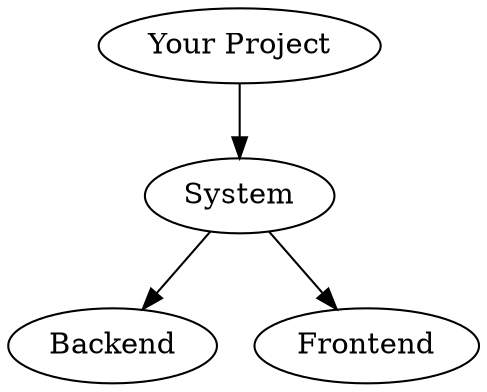
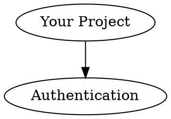

# Ralph's Infinity Rule List - Setup Guide

Step-by-step instructions to set up Ralph's Infinity Rule List in your project.

---

## Prerequisites

### Required

- **Python 3.10+** - For the orchestrator and agents
- **Git** - For checkpointing and version control
- **Roo Code** - AI coding assistant with agent mode support

### Optional

- **GraphViz** - For World Model visualization
- **Modern browser** - For the HTML dashboards

---

## Installation

### Step 1: Copy Files to Your Project

```bash
# Create the tools directory
mkdir -p your-project/tools/ralph_orchestrator

# Copy the core files
cp ralph_orchestrator/*.py your-project/tools/ralph_orchestrator/
cp -r ralph_orchestrator/agents your-project/tools/ralph_orchestrator/

# Copy the UI files
cp zoom_world_model.html your-project/tools/
cp ralph_control_panel.html your-project/tools/
cp compile_ralph_status.py your-project/tools/

# Copy the agent mode definitions
cp .roomodes your-project/
```

### Step 2: Set Up Python Dependencies

```bash
cd your-project

# Create virtual environment (recommended)
python -m venv venv
source venv/bin/activate  # On Windows: venv\Scripts\activate

# Install dependencies
pip install pyyaml graphviz  # For YAML and DOT file handling
```

### Step 3: Initialize the Ralph Directory

```bash
# Create .ralph directory structure
mkdir -p .ralph/{scratchpads,checkpoints,metrics,knowledge}

# The status.json will be auto-generated on first run
```

### Step 4: Configure Roo Code

Add this to your Roo Code settings (or verify `.roomodes` is loaded):

```json
{
  "customModesFile": ".roomodes",
  "agentModeSwitching": true
}
```

### Step 5: Generate Initial Status

```bash
# Compile the status file (creates ralph_status.js)
python tools/compile_ralph_status.py

# Verify it worked
cat ralph_status.js
```

---

## Configuration

### Customize Agent Names

Edit `.roomodes` to change agent names/slugs:

```yaml
- slug: agent1-build
  name: "Build Agent"  # Change this
  roleDefinition: |-    # Update responsibilities
    You are the Build System specialist for YOUR_PROJECT.
```

### Customize Specialist Areas

Each agent can be tailored to your project:

```yaml
# agent2-assets for 3D models
# agent3-world for game data
# agent4-vr for VR/AR
# agent5-physics for physics simulation
# agent6-testing for QA
# agent8-screenshot for visual verification
# agent7-docs for documentation
```

### Adjust Timeouts and Retries

In `ralph_orchestrator/agent_base.py`:

```python
class YourAgent(RalphAgent):
    TIMEOUT_SECONDS = 600  # 10 minutes instead of 5
    MAX_RETRIES = 5        # More retries for flaky operations
```

---

## Verification

### Test 1: Check Roo Code Modes

Open Roo Code and verify you see the agent modes:

```
Available Modes:
- ralph-orchestrator
- agent1-build
- agent2-assets
- agent3-world
- agent4-vr
- agent5-physics
- agent6-testing
- agent8-screenshot
- agent7-docs
```

### Test 2: Open the UI

```bash
# Open the Infinity List UI
open tools/zoom_world_model.html

# Or the standalone control panel
open tools/ralph_control_panel.html
```

You should see:
- Agent status cards
- Toggle button (🤖) for Ralph panel
- All agents showing "Ready" status

### Test 3: Test Clipboard Prompt

1. Click any agent card in the UI
2. A toast should appear: "🔨 Build prompt copied! Paste into Roo Code"
3. Paste into Roo Code
4. Roo Code should switch to the agent mode

### Test 4: Run Status Compiler

```bash
python tools/compile_ralph_status.py
```

Expected output:
```
Generated: tools/ralph_status.js
Also generated: ralph_status.js

--- Ralph Orchestrator Status ---
Status: IDLE
Cycle: 0
Current Agent: None

Agents: 0 running, 0 complete
```

---

## Project-Specific Setup

### For C++ Projects (like Chimera VR)

```yaml
# agent1-build configuration
roleDefinition: |-
  You are the Build System specialist for YOUR_PROJECT.

  Your responsibilities:
  - CMake configuration and generation
  - Compilation error diagnosis and fixing
  - Build optimization

  Build directory: build/
  Build system: CMake

customInstructions: |-
  Always:
  - Check build/CMakeCache.txt for existing config
  - Use Release configuration for builds
  - Run cmake --build build --config Release
```

### For Python Projects

```yaml
# agent1-build configuration
roleDefinition: |-
  You are the Build System specialist for YOUR_PROJECT.

  Your responsibilities:
  - pip/poetry dependency management
  - Virtual environment setup
  - Package building

customInstructions: |-
  Always:
  - Use poetry for dependency management
  - Run poetry install before builds
  - Check pyproject.toml for dependencies
```

### For Web Projects

```yaml
# agent1-build configuration
roleDefinition: |-
  You are the Build System specialist for YOUR_PROJECT.

  Your responsibilities:
  - npm/yarn dependency management
  - Webpack/Vite configuration
  - Build optimization

customInstructions: |-
  Always:
  - Run npm install before builds
  - Check package.json for scripts
  - Use production build mode
```

---

## World Model Setup

### Create Your DOT Cards

Create a `cards/` directory:

```bash
mkdir -p cards
```

### Example: Simple Card Structure



### Example: Detailed Card with Metadata



### Load Cards in the UI

1. Open `tools/zoom_world_model.html`
2. Cards are auto-loaded from the `cards/` directory
3. Click cards to view prompts and agent suggestions

---

## Troubleshooting

### Issue: Modes Not Showing in Roo Code

**Solution:**
1. Check `.roomodes` is in project root
2. Verify YAML syntax: `python -c "import yaml; yaml.safe_load(open('.roomodes'))"`
3. Restart Roo Code
4. Check Roo Code settings for `customModesFile` path

### Issue: Status File Not Updating

**Solution:**
1. Check `.ralph/` directory is writable
2. Verify `state_manager.py` can find the directory
3. Check for file locking issues
4. Try deleting `status.json` and regenerating

### Issue: UI Shows "Unknown agent"

**Solution:**
1. Check `ralph_status.js` was generated
2. Run `python tools/compile_ralph_status.py` manually
3. Verify script tag in HTML: `<script src="ralph_status.js"></script>`

### Issue: Scratchpad Not Persisting

**Solution:**
1. Check `.ralph/scratchpads/` directory exists
2. Verify `Scratchpad` class has correct path
3. Check file permissions

### Issue: Agent Not Marking Complete

**Solution:**
1. Verify agent calls `mark_complete()` or `mark_error()`
2. Check `AgentResult.success` is set correctly
3. Look for exceptions in agent code

---

## Advanced Setup

### Custom Agent Locations

If your project structure differs:

```python
# In agent_base.py, modify __init__
if scratch_dir is None:
    project_root = Path(__file__).parent.parent.parent  # Adjust as needed
    scratch_dir = project_root / ".ralph" / "scratchpads"
```

### Remote State Storage

For distributed teams:

```python
# Custom state manager that syncs to S3
class S3StateManager(RalphStateManager):
    def _write_status(self, status):
        super()._write_status(status)
        # Also upload to S3
        s3.upload_file(self.status_file, ...)
```

### Custom UI Themes

Edit the CSS variables in the HTML files:

```css
:root {
    --bg-deep: #050810;        /* Your background */
    --accent: #667eea;         /* Your accent color */
    --gold: #ffd700;           /* Your highlight color */
}
```

---

## Next Steps

After setup:

1. [Read the Usage Guide](USAGE.md) - Learn how to use the system
2. [Customize Your Agents](CUSTOM_AGENTS.md) - Tailor agents to your project
3. [Explore the Architecture](ARCHITECTURE.md) - Understand how it works

---

## Getting Help

- Check the [Architecture](ARCHITECTURE.md) for deep dives
- Review the [Troubleshooting](#troubleshooting) section
- Open an issue on GitHub

---

## Quick Reference

| File | Purpose |
|------|---------|
| `.roomodes` | Agent mode definitions for Roo Code |
| `tools/ralph_orchestrator/agent_base.py` | Base agent class |
| `tools/ralph_orchestrator/state_manager.py` | State file management |
| `tools/compile_ralph_status.py` | Generate JS from status |
| `tools/zoom_world_model.html` | Main UI |
| `tools/ralph_control_panel.html` | Standalone dashboard |
| `.ralph/status.json` | Runtime state (auto-generated) |
| `.ralph/scratchpads/*.md` | Agent memory (auto-generated) |
| `cards/*.dot` | World Model definitions (you create) |
